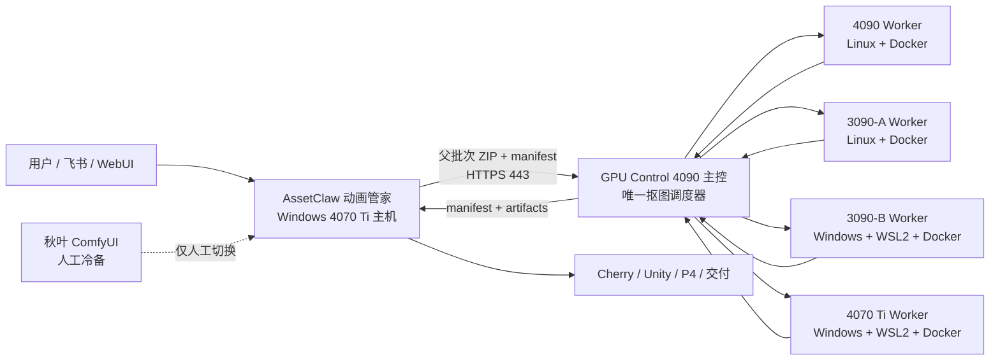
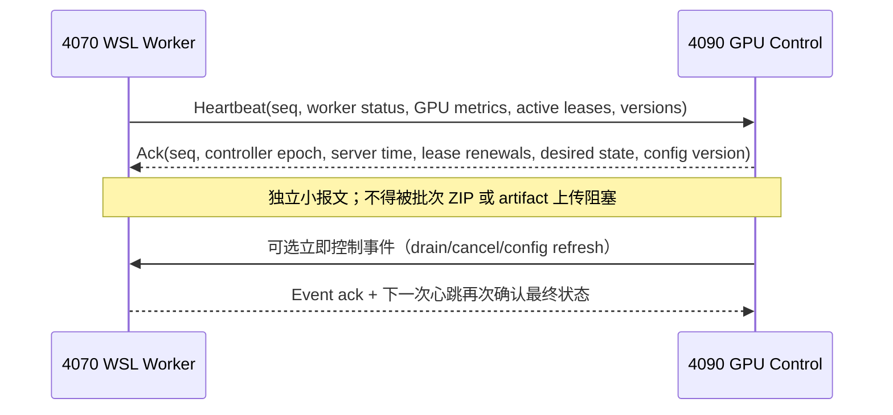

# 4070 Ti 接入 GPU Control 全分布式抠图集群对接合同

> **已被正式手册与实施回执取代。** 本草案中的 Worker Pull、双向租约/心跳等提议不得用于实现。正式协议为：Node Agent 向 4090 上报 HMAC 心跳，4090 Scheduler 主动向节点 ComfyUI 推送任务，NodeLease 由控制面内部管理。请以 `115_2026-08-12_4070TI_WSL2_PREPARATION_AND_INTEGRATION_HANDOFF.md` 和 `docs/GPU_CONTROL_4070TI_HOST_PREPARATION_RECEIPT_2026-08-12.md` 为准。

> 文档状态：`DRAFT_FOR_JOINT_REVIEW`  
> 文档日期：2026-08-12  
> AssetClaw 基线：`main@8cf1442c20e4`  
> GPU Control 当前实测基线：`1.5.12@093ae8b7966ae5beb86990c7881c11d4c24d4e51`
> GPU Control 历史兼容基线：`1.5.10@d504a820239797dd66d5ffe11178127743b99d6d`
> 目标节点：`DAC3OZhangqichao / RTX 4070 Ti / Windows + WSL2 + Docker`  
> 说明：本文既是架构合同，也是双方实施、验收和回滚清单。带有 `GPU Control 回填` 的项目在回填前不得进入正式生产。

## 1. 目标与冻结决策

本次改造的目标，是取消“4070 Ti 本机单独抠图 + 三台 GPU 集群抠图”的双层调度，形成由 4090 主控统一调度的四 GPU 分布式抠图集群。

以下决策冻结，不在本次联调中继续摇摆：

1. AssetClaw 动画管家仍运行在 4070 Ti 的 Windows 主机上，继续负责飞书/WebUI 接单、动画业务编排、拆帧、角色确认、Cherry 后处理、Unity、P4 和最终交付。
2. 所有生产抠图任务统一提交给 4090 GPU Control 主控；AssetClaw 不再自行决定“本机还是集群”。
3. 4070 Ti 通过 WSL2 + Docker 作为 GPU Control 的第四个正式 Worker，由 4090 主控发放抠图子任务。
4. 4090 主控只能控制 WSL2 内的抠图 Worker，不获得 Windows 宿主机、AssetClaw、飞书、P4、Unity、秋叶 ComfyUI 或任意宿主机 Shell 的控制权。
5. 当前秋叶 ComfyUI 原样保留，作为人工冷备；它不注册到集群、不参加自动调度、不得成为静默自动回退路径。
6. 4090、3090-A、3090-B、4070 Ti 的 Worker 运行时、镜像、工作流和协议应采用同一条受版本控制的交付链。
7. 4090 主控是唯一的抠图调度权威；AssetClaw 是唯一的动画业务状态权威。双方不得越权修改对方的业务状态。

## 2. 目标架构



任务边界必须保持为：

- AssetClaw 生成不可变父批次并提交。
- GPU Control 将父批次拆成可租约、可重试的 Worker 子任务。
- Worker 只处理被租约授权的帧，不感知动画业务。
- GPU Control 汇总结果并给出最终批次状态。
- AssetClaw 验证结果后原子发布，然后继续动画后处理。

## 3. 4070 Ti 主机已核实现状

| 项目 | 当前值 | 结论 |
|---|---|---|
| Windows 主机名 | `DAC3OZhangqichao` | 建议作为节点来源标识，不作为长期密钥 |
| Windows 版本 | Windows 10 Pro x64，`10.0.19045.3803`，UEFI | 支持 WSL2 |
| CPU | Intel Core i7-14700KF | 任务管理器已确认虚拟化启用 |
| 内存 | `68,557,664,256` bytes（约 63.85 GiB） | 足够承载 AssetClaw + 单并发 4070 Worker；仍需设资源上限 |
| GPU | NVIDIA GeForce RTX 4070 Ti | 第四 Worker |
| GPU UUID | `GPU-70c028e4-dd91-4337-8f96-29daa437d1c3` | 节点注册与验收使用 |
| 显存 | `12282 MiB` | 初始最大并发必须为 1 |
| Compute Capability | `8.9` | 镜像内 CUDA/PyTorch 必须支持 Ada |
| Windows NVIDIA 驱动 | `576.52` | 需与 WSL CUDA 兼容矩阵共同验收 |
| Windows 驱动声明 CUDA 上限 | `12.9` | 这是驱动能力，不等于容器内 CUDA Runtime 版本 |
| GPU PCI Bus ID | `00000000:01:00.0` | 仅作诊断；永久身份仍使用 GPU UUID |
| 主机 IPv4 | `10.3.34.238` | 当前采集值；若 DHCP，应在网关做保留地址 |
| 物理网卡 MAC | `34-5A-60-47-C6-1D` | 网关 DHCP Reservation 使用 |
| 物理网卡 | Intel Ethernet Controller (3) I225-V，1 Gbps | Windows 接口索引 7 |
| 网卡驱动 | Intel `1.1.4.43`，2024-02-15 | 联调异常时用于比对 |
| 子网 | `10.3.34.0/24`，掩码 `255.255.255.0` | 与 4090 `10.3.34.11` 同一 IPv4 子网 |
| 默认网关 | `10.3.34.1` | 当前采集值 |
| DHCP Server | `10.3.34.1` | 当前地址由 DHCP 分配 |
| DNS | `10.3.254.217`、`10.1.254.217` | WSL DNS 继承/代理需验收 |
| Windows 域 DNS 后缀 | `lilithgames.net` | 当前主机主 DNS 后缀 |
| Windows 防火墙 | Domain / Private / Public 均启用 | 只按最小端口增加规则 |
| 4090 主控 | `https://10.3.34.11:443` | AssetClaw 当前默认控制面地址 |
| WSL Windows 功能 | `Enabled`，重启后已复核 | 已生效 |
| VirtualMachinePlatform | `Enabled`，Hypervisor 已检测 | 已生效 |
| WSL 运行时 | `2.7.11.0` | 2026-08-12 重启后实测 |
| WSL Kernel | `6.18.33.2-2` | 2026-08-12 重启后实测 |
| WSLg | `1.0.73.2` | Worker 不依赖 GUI |
| WSL 默认发行版版本 | `2` | 后续发行版默认创建为 WSL2 |
| Linux 发行版 | 未安装 | 等 GPU Control 按 3090-B 基线指定 |
| Docker | 未安装 | 等重启及发行版基线确认后安装 |
| NVIDIA Container Toolkit | 未安装 | 与 Docker Engine 一并安装、验收 |
| 秋叶 ComfyUI | 保留 | 不修改、不纳管、不开放给集群 |
| 系统盘 | C: NTFS，约 931.12 GiB；重启及临时文件收敛后空闲约 376.90 GiB | WSL VHDX/Docker/模型必须设配额和水位线 |

重要：当前“未安装 Docker”不是遗漏。为了避免出现第四套运行环境，4070 Ti 必须复用 3090-B 已验证的 WSL2 发行版、Docker Engine 和启动方式。GPU Control 团队应先回填第 22 节，再继续安装。

## 4. Windows / WSL2 / Docker 环境合同

### 4.1 已完成的 Windows 前置操作

```powershell
dism.exe /online /enable-feature /featurename:Microsoft-Windows-Subsystem-Linux /all /norestart
dism.exe /online /enable-feature /featurename:VirtualMachinePlatform /all /norestart
wsl.exe --install --no-distribution --web-download
```

两个 DISM 操作均成功返回 `3010`，代表组件已写入但尚待重启。不得把“命令成功”误判为“WSL2 已可运行”。

### 4.2 重启后的本机验收

重启由机器管理员人工执行。重启后依次检查：

```powershell
wsl.exe --version
wsl.exe --status
wsl.exe --set-default-version 2
wsl.exe --list --verbose
nvidia-smi
```

2026-08-12 已完成重启和验收，结果：

- `wsl --version` 正常输出 WSL `2.7.11.0` 与 Kernel `6.18.33.2-2`。
- 默认版本为 WSL2。
- 两个 Windows 功能均为 `Enabled`，系统已检测到 Hypervisor。
- Windows `nvidia-smi` 正常识别 4070 Ti，驱动仍为 `576.52`。
- 当前尚无 Linux 发行版；这是等待 3090-B 精确基线的有意状态。

### 4.3 发行版与容器运行时

不得根据个人习惯直接安装“最新版”。正式安装必须复制 3090-B 的已验证基线：

| 组件 | GPU Control 必须给出的锁定值 |
|---|---|
| WSL 发行版及版本 | 例如 Ubuntu 22.04，但以 3090-B 实际值为准 |
| WSL Kernel 最低/推荐版本 | 待回填 |
| Docker Engine | 精确版本，禁止仅写 latest |
| Docker Compose 插件 | 精确版本 |
| NVIDIA Container Toolkit | 精确版本 |
| NVIDIA Container Runtime 配置方式 | 待回填 |
| Worker 镜像 | Registry、Tag、不可变 Digest |
| Worker 启动方式 | Compose / systemd / 其他，需给正式文件 |
| 镜像升级与回滚命令 | 待回填 |

容器约束：

- 生产镜像必须使用 `image@sha256:<digest>`，不能只用可漂移 Tag。
- 禁止把宿主 Docker API 暴露在 `0.0.0.0:2375` 或无 TLS 的 TCP 端口。
- Worker 使用非 root 进程；只挂载任务缓存、模型只读目录和必要日志目录。
- 高 IO 任务、模型和 Docker data-root 位于 WSL2 ext4 虚拟磁盘内，不使用 `/mnt/c` 作为热路径。
- 容器必须设置内存、共享内存、PID、日志轮转和健康检查限制。
- 初始 `max_concurrency=1`；只有通过显存峰值和长稳测试后才能提高。
- Windows 与 WSL 自动启动策略必须经过“重启后无人值守恢复”验收。

### 4.4 GPU 容器验收

发行版和 Docker 安装完成后至少验证：

```bash
docker version
docker compose version
docker info
docker run --rm --gpus all <GPU_CONTROL_APPROVED_CUDA_IMAGE_DIGEST> nvidia-smi
```

容器内必须看到同一块 GPU UUID：

```text
GPU-70c028e4-dd91-4337-8f96-29daa437d1c3
```

### 4.5 磁盘配额与清理水位

4070 主机只有一个 C: 盘，同时承载 Windows、AssetClaw、秋叶冷备和新的 WSL2 Worker。不得允许 WSL `ext4.vhdx`、Docker image layer、模型和任务缓存无上限增长。

建议初始预算：

| 用途 | 初始预算 | 管理要求 |
|---|---:|---|
| Windows + 应用与现有业务保留 | 约 570 GiB 当前已用 | 不迁移、不纳入 Worker 清理 |
| WSL2 发行版、Docker Engine 与基础镜像 | 30–50 GiB | 镜像按 digest，定期删除无引用 layer |
| Worker 模型只读库存 | 40–80 GiB | 由模型 manifest 管理；禁止重复下载不同路径 |
| Worker 任务缓存和 artifact staging | 40–80 GiB | 仅保留活动租约和短期终态；主控确认后回收 |
| 预留 Windows 安全空间 | 不低于 150 GiB | 不能被 WSL VHDX 使用完 |

磁盘控制线：

- C: 空闲 `< 180 GiB`：告警，暂停非必要镜像预拉取和模型副本。
- C: 空闲 `< 150 GiB`：Worker 进入 `DRAINING`，停止接新批次，清理已确认终态缓存。
- C: 空闲 `< 100 GiB`：Worker 进入 `UNHEALTHY/QUARANTINED`，只允许完成安全收敛和运维清理。
- WSL 内任务盘使用率 `> 80%` 告警，`> 90%` 停止接单。
- Docker 日志必须轮转；单容器建议 `max-size=100m`、`max-file=5`，最终值由 GPU Control 回填。
- GPU Control 必须提供终态 artifact 的确认/保留时长；Worker 不永久保存父批次 ZIP 或结果 ZIP。
- 清理 WSL 文件后，VHDX 逻辑空闲不一定立即归还 Windows；维护窗口中应按所选 WSL 版本使用受支持的稀疏 VHD/压缩流程，并在操作前停止发行版和备份关键配置。

2026-08-12 本机已完成一次证据化清理：删除终态任务可重建中间件、GPU 批次 ZIP、重复快照、旧附件与开发缓存；最终交付包、源素材、状态、当前数据库、稳定回滚基线和秋叶环境均保留。详细记录见 `docs/C_DRIVE_CLEANUP_2026-08-12.md`。

## 5. 网络合同

### 5.1 原则

1. 所有控制面和数据面通信只走可信内网，不通过 Cloudflare Tunnel 或公网反向代理。
2. AssetClaw 到 4090 主控使用 `HTTPS https://10.3.34.11:443`。
3. TLS 校验必须开启；禁止 `verify=false`、跳过证书或长期使用无法校验主机名/IP 的临时证书。
4. Worker 优先采用“向主控出站注册、心跳、拉取/租约任务”的模式。不要让 4090 持久依赖 WSL2 动态内部 IP。
5. 4070 Ti 的网络模型应直接复用 3090-B，而不是为第四节点新造协议。

### 5.1.1 当前已知集群网络清单

下表来自仓库既有 V3 对接文档，是联调线索而不是本次探测结果；4090 团队必须在回执中重新确认：

| node_id | 文档记录 MAC | 文档记录地址 | 角色 | 本次要求 |
|---|---|---|---|---|
| `control-4090` | `58:11:22:c1:66:63` | `10.3.34.11` | 控制面、归档、可调度 GPU | 复核地址/MAC/证书/端口 |
| `worker-3090-a` | `18:c0:4d:9f:13:13` | `10.3.34.12` | Linux Worker | 复核运行时基线 |
| `worker-3090-b` | `2c:f0:5d:76:7b:70` | 历史动态地址 `10.3.34.4` | Windows + WSL2 Worker | 提供可复制部署与网络配置 |
| `worker-4070ti-animation-host-01` | `34:5a:60:47:c6:1d` | `10.3.34.238`（DHCP） | 新增 Windows + WSL2 Worker | 配 DHCP Reservation 后接入 |

节点身份必须由 `node_id + credential + GPU UUID + image/model identity` 建立，MAC/IP 只作为网络准入与审计佐证。

### 5.2 连接矩阵

| 来源 | 目标 | 方向 | 端口/协议 | 用途 | 要求 |
|---|---|---|---|---|---|
| AssetClaw Windows | 4090 主控 `10.3.34.11` | 出站 | TCP 443 / HTTPS | 父批次提交、状态、manifest、artifact、取消 | 必须允许 |
| 4070 WSL Worker | 4090 主控 | 出站优先 | `GPU Control 回填` | 注册、心跳、租约、结果上传 | 必须允许 |
| 4090 主控 | 4070 WSL Worker | 仅协议确需时 | `GPU Control 回填` | 回调或控制 | 默认不开放；确需时限定源 IP |
| 4070 Worker | 镜像仓库 | 出站 | 443 / HTTPS | 拉取锁定镜像 | 仅允许指定 Registry |
| 4070 Worker | 模型仓库 | 出站或内网 | `GPU Control 回填` | 首次同步模型 | 生产建议内网只读源 |
| 任意局域网节点 | Docker API | 入站 | TCP 2375 | Docker 远程控制 | 明确禁止 |
| 任意集群节点 | 秋叶 ComfyUI | 入站 | 常见 8188 | 访问冷备 | 明确禁止 |
| 互联网 | 4070 Worker/AssetClaw | 入站 | 任意 | 控制或任务 | 明确禁止 |

### 5.3 地址与名称

- 4070 Windows 当前地址为 `10.3.34.238/24`，物理网卡 MAC 为 `34-5A-60-47-C6-1D`。正式上线前应由网络管理员在 DHCP Server `10.3.34.1` 上用该 MAC 配置 Reservation，优先保留 `10.3.34.238`，避免日志、ACL 和节点身份漂移。
- 当前活动物理接口为 Intel I225-V，Windows 接口索引 `7`，链路速率 `1 Gbps`；默认路由为 `0.0.0.0/0 → 10.3.34.1`，路由 metric `25`。
- 当前 DNS 为 `10.3.254.217`、`10.1.254.217`，主 DNS 后缀为 `lilithgames.net`。若主控证书使用 DNS 名称，GPU Control 必须给出可由这两个 DNS 解析、且在证书 SAN 中存在的正式 FQDN。
- 机器还存在断开的 TAP、Wintun、Bluetooth 虚拟/辅助网卡。Worker 绑定、回调或防火墙脚本不得按“第一块网卡”猜测，必须明确绑定活动 I225-V、`10.3.34.238` 或主控认可的接口策略。
- WSL2 NAT 地址可能在重启后改变，不得作为永久节点 ID。
- 节点永久标识建议为 GPU Control 分配的 `worker_id`，例如 `worker-4070ti-animation-host-01`。
- 节点硬件佐证使用 GPU UUID；不得只依赖容易变化的 IP 或容器名。
- 如果 4090 必须主动连接 Worker，应由 GPU Control 团队提供经 3090-B 验证的 Windows 端口转发和防火墙脚本，并说明重启自愈方式。

### 5.4 4090 如何连接 4070 WSL2

首选方案是 **Worker 主动发起连接**：

1. 4070 WSL2 Worker 从 NAT 内主动连接 `10.3.34.11:<worker-control-port>`。
2. 连接建立后完成双向鉴权、注册、双向心跳和任务租约。
3. 任务输入/结果通过该受控 API 或对象存储传输。
4. 4090 不需要知道 WSL2 的临时 `172.x/20.x` 地址，也不需要在 Windows 上开放任意 Docker/ComfyUI 端口。

如果现有 GPU Control 的 Worker 协议要求 4090 主动访问 4070，则只能从下列方案选择一个，并在回执中明确：

- 复用 3090-B 已验证的 WSL mirrored networking；或
- Windows 固定监听端口 + `portproxy`/受控反向代理到当前 WSL 地址，并配置开机自愈任务；或
- Worker 建立持久反向通道，由 4090 在通道内发指令。

无论选择哪种方案，4090 连接目标都应是稳定的 Windows 地址/FQDN或既有反向通道，而不是把某次启动后的 WSL NAT IP 写死。Windows 防火墙入站规则必须同时限定：协议、端口、来源 `10.3.34.11`、程序/服务以及 Domain/Private profile；不得使用 `Any/Any`。

推荐把双向控制面建立在 Worker 主动发起的长连接上，例如同一条经认证的 WSS 或 HTTP/2 双向流。这样 4090 可以在已建立的安全通道内回送心跳确认、续租、取消、drain 和配置指令，而不需要直接访问 WSL NAT 地址。最终传输协议和 endpoint 由 GPU Control 团队按既有实现回填，不把本文示例当成已实现 API。

### 5.5 TLS 与当前客户端配置

当前 AssetClaw `.env` 已核验：

| 配置 | 当前值 | 上线处理 |
|---|---|---|
| `GPU_CONTROL_BASE_URL` | `https://10.3.34.11` | 保留或改正式 FQDN |
| `GPU_CONTROL_VERIFY_TLS` | `true` | 必须保持 true |
| `GPU_CONTROL_CA_BUNDLE` | `C:\Users\zhangqichao\Downloads\GPU_CONTROL_LAN_CA.crt` | 当前文件存在；建议迁到受管配置目录 |
| LAN CA SHA-256 | `ad4a4dbd95bb789be03451ff0c25b2bc65dfe170428bd675789c2ebba1e6dc2b` | 4090 团队回执复核 |
| `GPU_CONTROL_ALLOW_CA_WITHOUT_KEY_USAGE` | `true` | 当前兼容项；后续换规范证书后应移除 |
| `GPU_CONTROL_API_KEY` | `.env` 中不存在 | 正式切换前必须签发并注入 |
| `MATTING_BACKEND_MODE` | `hybrid` | 联调完成后再改 `gpu_control`，现在不提前切生产 |

Worker Credential 与上述 AssetClaw API Key 必须分开。建议 Worker 使用短期 mTLS 客户端证书或可轮换 token，并把凭证约束到唯一 `worker_id/GPU UUID`。

### 5.6 2026-08-12 重启后连通性实测

| 检查 | 结果 |
|---|---|
| 本机地址 | `10.3.34.238/24`，DHCP，重启后未漂移 |
| 本机 MAC | `34-5A-60-47-C6-1D`，重启后未漂移 |
| 4090 TCP | `10.3.34.11:443` 成功 |
| 路由 | 同网段直达，首跳即 `10.3.34.11`，小于 1 ms |
| Python/httpx + LAN CA `/health/live` | 200，`live` |
| Python/httpx + LAN CA `/health/ready` | 200，database/redis 均 ok |
| Python/httpx + LAN CA `/api/v1/scheduler/capacity` | 200，3 compatible nodes、3 available slots、queue 0 |
| Windows curl/Schannel + LAN CA | 失败：`CERT_TRUST_REVOCATION_STATUS_UNKNOWN` |

Schannel 失败不能用 `-k/--insecure` 绕过。AssetClaw 当前 Python TLS 栈验证证书链成功，所以生产客户端可用；但 GPU Control 团队仍应提供可访问的 CRL/OCSP、规范的 LAN 证书或书面说明吊销策略，使 Windows 原生 TLS 工具也能完整验证。

当前主控 `/api/v1/version` 实测：

```json
{
  "component": "api",
  "version": "1.5.12",
  "package_version": "1.5.12",
  "build_version": "1.5.12",
  "source_revision": "093ae8b7966ae5beb86990c7881c11d4c24d4e51",
  "version_aligned": true,
  "provenance_complete": true
}
```

这取代 1.5.10 作为本次接入的目标控制面基线。1.5.10 仅作为已验证历史协议参考，不能据此选择 4070 Worker镜像。

控制台静态资源显示节点管理面存在 `/admin/nodes` 及 `mode/free/interrupt/restart/start/stop` 操作；匿名只读访问 `/admin/nodes` 返回 401 `AUTH_FAILED`，符合管理面保护要求。当前没有公开 Worker注册、双向心跳和租约 schema，因此必须由 GPU Control 团队交付 1.5.12 配套 Worker部署包和凭证，不允许客户端猜测管理接口。

## 6. 版本与供应链合同

### 6.1 已知业务协议基线

| 项目 | 锁定值 |
|---|---|
| GPU Control current | `1.5.12` |
| GPU Control current commit | `093ae8b7966ae5beb86990c7881c11d4c24d4e51` |
| GPU Control historical verified baseline | `1.5.10@d504a820239797dd66d5ffe11178127743b99d6d` |
| AssetClaw commit | `8cf1442c20e4` |
| `workflow_key` | `imageclip-rgba` |
| `workflow_version` | `2026.07.30-691770c-r1` |
| `pipeline_commit` | `691770cd6a59fd7c51391456fe900dc57a313233` |
| `pipeline_sha256` | `00e7104762f0a1fdf3a4c20e043bec2b9f088132452d5a5ce4302ba268edac0b` |
| `output_node` | `SaveImage #25` |
| manifest schema | `1.0` |

### 6.2 Worker 运行时必须锁定

四台节点必须输出可机器比对的运行时清单：

- Worker Agent 版本与 commit。
- 容器镜像完整 digest。
- 基础 OS 镜像 digest。
- Python、PyTorch、CUDA Runtime、cuDNN 精确版本。
- ComfyUI commit 及所有自定义节点 commit。
- 工作流文件 SHA-256。
- 所有模型文件的相对路径、字节数与 SHA-256。
- 启动配置 SHA-256。

调度器必须在派发前根据 `workflow_key/version`、显存要求和模型清单过滤不兼容节点。版本不一致的节点只能 `DRAINED` 或 `QUARANTINED`，不能带病接单。

## 7. Worker 注册、双向心跳和租约协议

4090 主控应为 4070 Worker 建立独立身份，不复用 AssetClaw API Key。

Worker 注册至少包含：

```json
{
  "worker_id": "worker-4070ti-animation-host-01",
  "hostname": "DAC3OZhangqichao",
  "gpu_uuid": "GPU-70c028e4-dd91-4337-8f96-29daa437d1c3",
  "gpu_model": "NVIDIA GeForce RTX 4070 Ti",
  "vram_mib": 12282,
  "compute_capability": "8.9",
  "max_concurrency": 1,
  "image_digest": "sha256:GPU_CONTROL_TO_FILL",
  "workflow_inventory": [],
  "model_inventory_digest": "sha256:GPU_CONTROL_TO_FILL"
}
```

节点状态至少应有：

- `STARTING`：环境启动，尚未接单。
- `READY`：健康、版本一致、可接单。
- `BUSY`：持有一个或多个租约。
- `DRAINING`：不接新任务，等待当前任务结束。
- `DRAINED`：已安全下线。
- `UNHEALTHY`：健康检查失败。
- `QUARANTINED`：身份、模型、结果或重复故障不可信。
- `OFFLINE`：心跳超时。

### 7.1 双向心跳模型

双向心跳不是双方各自发送一个无状态 `ping`，而是一次带序列号、确认号和目标状态的控制面交换：



Worker → 4090 的每次心跳至少包含：

- `worker_id`、`session_id`、单调递增 `heartbeat_seq`。
- Worker 本地 UTC 时间、进程 uptime、最近一次主控确认时间。
- `STARTING/READY/BUSY/DRAINING/DRAINED/UNHEALTHY/QUARANTINED` 当前状态。
- GPU UUID、利用率、显存已用/总量、温度、功耗、P-State。
- CPU、内存、任务盘/模型盘剩余空间。
- 当前容器 digest、Worker commit、workflow/model inventory digest。
- 所有活动租约的 `batch_id/child_job_id/lease_id/attempt/progress/last_progress_at`。
- 自上次心跳以来完成、失败、取消、OOM 和上传错误摘要。

4090 → Worker 的心跳确认至少包含：

- 原样确认 `heartbeat_seq`，以及 4090 当前 `controller_epoch`、`server_time_utc`。
- Worker 会话是否仍有效，凭证是否临近过期。
- 每个活动租约的 `RENEWED/REVOKED/EXPIRED/UNKNOWN` 结果和新 `expires_at`。
- 主控要求的 `desired_state`：例如 `READY`、`DRAINING` 或 `QUARANTINED`。
- 当前配置版本、允许的 workflow/model/image identity、是否要求刷新。
- 待处理控制指令的唯一 `command_id`；Worker 回执必须幂等。
- 主控视角的下一次心跳截止时间，便于双方分别检测对端失联。

建议的心跳报文示例（字段名可按现有 GPU Control 协议映射，但语义不可丢失）：

```json
{
  "type": "worker.heartbeat",
  "protocol_version": "GPU_CONTROL_TO_FILL",
  "worker_id": "worker-4070ti-animation-host-01",
  "session_id": "01J...",
  "heartbeat_seq": 183,
  "sent_at_utc": "2026-08-12T07:10:10.123Z",
  "state": "BUSY",
  "identity": {
    "gpu_uuid": "GPU-70c028e4-dd91-4337-8f96-29daa437d1c3",
    "image_digest": "sha256:...",
    "worker_commit": "...",
    "workflow_inventory_digest": "sha256:...",
    "model_inventory_digest": "sha256:..."
  },
  "resources": {
    "gpu_util_percent": 94,
    "vram_used_mib": 10420,
    "vram_total_mib": 12282,
    "gpu_temperature_c": 67,
    "disk_free_bytes": 123456789000
  },
  "active_leases": [
    {
      "batch_id": "...",
      "child_job_id": "...",
      "lease_id": "...",
      "attempt": 1,
      "completed_items": 7,
      "total_items": 12,
      "last_progress_at_utc": "2026-08-12T07:10:08.000Z"
    }
  ]
}
```

```json
{
  "type": "controller.heartbeat_ack",
  "protocol_version": "GPU_CONTROL_TO_FILL",
  "worker_id": "worker-4070ti-animation-host-01",
  "session_id": "01J...",
  "heartbeat_seq_ack": 183,
  "controller_epoch": 42,
  "server_time_utc": "2026-08-12T07:10:10.140Z",
  "desired_state": "READY",
  "next_heartbeat_due_at_utc": "2026-08-12T07:10:20.140Z",
  "config_version": "sha256:...",
  "lease_decisions": [
    {
      "lease_id": "...",
      "attempt": 1,
      "decision": "RENEWED",
      "expires_at_utc": "2026-08-12T07:12:10.140Z"
    }
  ],
  "commands": []
}
```

### 7.2 双向失联判断

- 4090 连续超过 `worker_offline_after_seconds` 未收到 Worker 心跳，将 Worker 置为 `OFFLINE`，停止派发新租约。
- Worker 连续超过 `controller_unreachable_after_seconds` 未收到有效 Ack，立即停止领取新任务，但可以在安全窗口内完成/暂存当前帧。
- Worker 不能只凭本地完成就发布；恢复连接后必须由当前主控 epoch 和有效租约确认上传/发布权。
- 网络恢复后必须创建或确认 `session_id`；旧 session、旧 epoch、旧 attempt 的迟到结果不能覆盖新结果。
- 双向时钟不作为唯一正确性依据，租约正确性依赖 `controller_epoch + lease_id + attempt`；时间仅用于超时和审计。

### 7.3 租约与通道隔离

租约必须有 `lease_id`、`attempt`、`leased_at`、`expires_at`、续租间隔和主控纪元。Worker 只接受当前纪元和当前租约，避免主控重启或网络分区后双重执行。

心跳/租约控制面与父批次 ZIP、输入帧和 artifact 数据面必须使用独立连接池、独立超时和独立并发限制。大文件上传不能耗尽心跳连接，心跳也不能无限占用数据带宽。

初始建议心跳间隔 10 秒、主控 30–45 秒判 Worker 离线；最终值由 GPU Control 根据现有 3090-B 实测回填。租约时长必须高于最慢单帧 P99 并允许续租，不能只放在代码常量中。

## 8. 调度原则

四块 GPU 是异构资源，不应采用固定四等分：

- 4090 主控根据可用显存、运行中租约、历史吞吐、工作流兼容和故障率动态派发。
- 4070 Ti 初始权重低于 4090，最大并发为 1。
- 父批次应拆成可重新租约的小片段，支持 work stealing，避免最慢节点拖住整批。
- 子任务大小应在减少调度开销与降低尾延迟之间动态选择；不得硬编码“一个父任务由某一台扣到死”。
- 同一帧在同一有效租约中只能有一个发布权。迟到结果必须被拒绝或标记为 orphan，不能覆盖新 attempt。
- 节点温度、显存余量、错误率超阈值时自动停止派新任务，但不得把 AssetClaw 父批次错误地标成失败。
- `/api/v1/scheduler/capacity` 在 4070 正式上线后必须反映 4 个合格节点及其能力，而不是只返回总 GPU 数。

## 9. AssetClaw 父批次提交协议

继续沿用 GPU Control V4.1 已验证协议：

- `POST /api/v1/batches/imageclip-rgba`
- `GET /api/v1/batches/{batch_id}`
- `GET /api/v1/batches/{batch_id}/manifest`
- 批次取消接口
- Artifact 下载接口，支持 Range 续传
- `/health/live`、`/health/ready`、`/api/v1/scheduler/capacity`

父批次是不可变 ZIP + manifest：

- ZIP 使用 `ZIP_STORED`，避免重复压缩图像消耗 CPU。
- 每个输入帧必须有稳定 ordinal、相对路径、字节数和 SHA-256。
- 禁止绝对路径、`..`、盘符、反斜杠逃逸、重复规范化路径和符号链接逃逸。
- `external_id` 与 `Idempotency-Key` 使用：`assetclaw:<parent_run_id>:matting:g<generation>`。
- 相同幂等键只能对应完全相同的不可变请求；内容变化必须增加 generation。
- AssetClaw 不向 Worker 直接提交帧，也不绑定具体 GPU。

推荐 manifest 摘要：

```json
{
  "schema_version": "1.0",
  "external_id": "assetclaw:<parent_run_id>:matting:g0",
  "workflow_key": "imageclip-rgba",
  "workflow_version": "2026.07.30-691770c-r1",
  "pipeline_commit": "691770cd6a59fd7c51391456fe900dc57a313233",
  "pipeline_sha256": "00e7104762f0a1fdf3a4c20e043bec2b9f088132452d5a5ce4302ba268edac0b",
  "output_node": "SaveImage #25",
  "items": []
}
```

## 10. Worker 子任务协议

父批次如何拆分属于 GPU Control 内部实现，但 Worker 子任务合同至少包含：

- `batch_id`、`parent_external_id`、`child_job_id`。
- `lease_id`、`attempt`、`scheduler_epoch`、租约截止时间。
- workflow 五项身份和容器镜像 digest。
- 帧 ordinal、源对象定位、源 SHA-256、预期输出相对路径。
- 结果上传的预签名地址或受控 API，不允许任意文件系统路径。
- 每帧完成、失败、重试的结构化状态和错误码。

Worker 必须先校验输入 hash，再执行工作流；上传完成后上报输出 hash、字节数、宽高、通道数和 alpha 统计。Worker 不直接改变父批次最终状态。

## 11. 工作流与模型身份

以下五项必须在父批次最终 manifest 中全部存在且完全相等：

1. `workflow_key`
2. `workflow_version`
3. `pipeline_commit`
4. `pipeline_sha256`
5. `output_node`

当前 AssetClaw 兼容逻辑会把远端缺失字段归为 `PARTIAL_MATCH/UNVERIFIED_MISSING`。在全远端切换前必须收紧为：任意字段缺失或不一致均不得发布结果，状态进入可诊断失败/隔离流程。不能让“远端没说版本”被当成“可能一致”。

模型清单建议格式：

| logical_name | container_path | size | sha256 | required |
|---|---|---:|---|---|
| `GPU Control 回填` | `GPU Control 回填` | `GPU Control 回填` | `GPU Control 回填` | true |

四节点上线前逐台生成并比对该清单；只比文件名不算通过。

## 12. 结果、部分成功与发布合同

GPU Control 父批次终态：

- `SUCCEEDED`：全部请求帧成功，结果清单完整。
- `PARTIAL_SUCCESS`：部分帧成功，必须返回精确 `failed_items`。
- `FAILED`：本 generation 无可安全发布的完整结果。
- `CANCELLED`：确认取消意图且主控已完成取消收敛。

AssetClaw 下载后逐项验证：

- manifest schema 和五项 workflow identity。
- `batch_id`、`external_id`、generation 一致。
- 路径规范化与输出数量。
- 每个文件的 SHA-256、字节数、PNG 可解码性、尺寸和 RGBA/alpha 语义。
- Range 续传完成后的全文件 hash。
- staging 验证全部通过后再原子发布，失败不得污染正式输出目录。

`PARTIAL_SUCCESS` 采用仅失败帧修复：成功帧保持不可变，新 generation 只提交 `failed_items`，客户端最多自动执行两个修复 generation。超过上限进入人工诊断。

现有 manifest 仍包含 `failure_policy=all_or_nothing`，但协议又允许 `PARTIAL_SUCCESS`。GPU Control 必须书面确认其含义：建议解释为“单个 generation 的正式发布必须完整”，而不是禁止跨 generation 的失败帧修复；双方代码和文档必须使用同一定义。

## 13. 取消、超时、重启与网络分区

- AssetClaw 超时 watchdog 只记录和告警，不得把“等待过久”自动等同于用户取消。
- 用户取消意图必须持久化，AssetClaw 重启后继续收敛远端状态。
- GPU Control 收到取消后停止发新租约，并尝试撤销/等待在途租约。
- Worker 迟到上传不能把已取消批次变回成功。
- 远端返回非法取消状态时，AssetClaw 保持可诊断状态，不能伪造成功。
- Worker 断联后，租约到期才能安全重派；旧 Worker 恢复后的迟到结果不得获发布权。
- 4090 主控重启后必须从持久化状态恢复批次、租约纪元、取消意图和 artifact 引用。
- 4070 Windows/WSL 重启后，Worker 自动恢复为 `STARTING`，完成版本/模型/健康校验后才能进入 `READY`。

## 14. 秋叶 ComfyUI 冷备政策

秋叶环境保持原目录、依赖、模型和启动方式，不纳入 Docker 改造。

冷备启用必须是人工变更：

1. 确认 GPU Control 大面积不可用且无法在业务时限内恢复。
2. 暂停新父批次提交，保留所有远端批次状态。
3. 为本地冷备创建新的 generation/route 标识，例如 `local_backup`，禁止复用远端幂等键。
4. 明确记录操作人、时间、原因、影响批次和恢复条件。
5. 集群恢复后先 drain 本地冷备，再切回全远端；不得双写同一正式输出目录。

禁止自动从 GPU Control 静默回退秋叶，因为这会造成版本漂移、重复计算、双重发布和故障被掩盖。

## 15. AssetClaw 侧改造清单

1. 生产配置固定 `MATTING_BACKEND_MODE=gpu_control`。
2. 删除/停用正常生产路径中的 64 帧 hybrid 阈值、本机 busy overflow、本机 OOM fallback 和本地串行 route lock。
3. 动画管家只对接 4090 主控，不感知四台 Worker 的地址。
4. GPU Control API Key 在生产必须显式配置，不允许空密钥启动为 ready。
5. TLS CA/证书校验失败必须阻止生产提交。
6. 五项 workflow identity 缺失或不匹配改为硬失败，不允许 `UNVERIFIED_MISSING` 发布。
7. WebUI 展示“统一 GPU Control 调度”、父批次、generation、集群容量和最终运行节点；不再展示误导性的“本机/远端二选一”。
8. 保留完整 `failed_items`、attempt、repair generation 和节点诊断信息。
9. 后续 Cherry、Unity、P4 和交付流程仍由父动画 run 驱动，不迁到 4090。

## 16. GPU Control 侧改造清单

1. 提供 3090-B 当前可复用的 WSL2/Docker 基线和不可变部署包。
2. 为 4070 建立独立 Worker 身份、短期凭证和撤销机制。
3. 支持 12 GB 显存节点的 capability filter，初始并发 1。
4. 将大批次动态拆分到四台节点，支持小租约、续租、过期重派与迟到结果拒绝。
5. 提供 drain、quarantine、恢复和滚动升级操作。
6. 父批次 manifest 返回实际执行 workflow identity、镜像 digest 和逐帧执行节点。
7. `/scheduler/capacity` 提供节点级状态、显存、并发、兼容工作流和排队信息。
8. 统一四节点模型清单和 SHA-256，阻止漂移节点接单。
9. 公开 `PARTIAL_SUCCESS` 与 `failure_policy` 的最终语义。
10. 提供从 1.5.10 基线升级时的数据库迁移、备份和回滚步骤。

## 17. 可观测性

所有日志和指标使用同一组关联字段：

- `parent_run_id`
- `external_id`
- `generation`
- `batch_id`
- `child_job_id`
- `lease_id`
- `attempt`
- `worker_id`
- `gpu_uuid`
- `workflow_version`
- `image_digest`

时间统一保存 UTC ISO-8601，并在 UI 展示时转换为 Asia/Shanghai；所有节点配置 NTP/Windows Time，同步偏差建议小于 2 秒。

节点指标至少包括 GPU 利用率、显存使用/峰值、温度、功耗、任务吞吐、单帧 P50/P95/P99、队列等待、租约过期、重试率、失败码和 artifact 上传速度。

告警至少覆盖：Worker 离线、版本/模型漂移、连续 OOM、温度过高、租约风暴、批次长尾、结果 hash 错误、磁盘空间不足和 TLS/凭证即将过期。

## 18. 安全边界

- AssetClaw Client Key 与 Worker Credential 分离，权限最小化。
- Worker 凭证只能注册、领取租约、上报指定任务结果，不能创建动画任务或读取其他业务数据。
- 4090 主控不得持有 Windows 管理员密码、宿主 Docker 未加密控制权或 AssetClaw/P4 凭证。
- Secrets 通过环境机密或受控 secret store 注入，不写入仓库、镜像、Compose 明文和日志。
- Artifact 接口校验批次归属；预签名 URL 有短过期时间和对象范围。
- 所有输入/输出路径经过规范化和根目录约束，拒绝 Zip Slip、盘符、UNC、绝对路径和符号链接逃逸。
- 镜像来源只允许批准的 Registry 和 digest，升级前执行漏洞扫描及 SBOM 留档。

## 19. 分阶段迁移

### 阶段 0：双方回填与冻结

- GPU Control 完成第 22 节回执。
- 双方冻结发行版、Docker、镜像、模型和协议版本。
- 确认 3090-B 的网络与自动启动方案可复用。

### 阶段 1：4070 基础环境

- 人工重启 Windows，使已启用的 WSL2 组件生效。
- 安装锁定发行版、Docker Engine、Compose、NVIDIA Container Toolkit。
- 完成 GPU 容器与重启自愈验收。

### 阶段 2：隔离节点冒烟

- 4070 以 `DRAINED` 注册。
- 完成模型同步、identity 比对、1/6/30 帧定向任务。
- 不接生产流量。

### 阶段 3：小流量 Canary

- 只允许显式 canary 父批次调度到 4070。
- 对比 4090/3090 输出 hash 或经批准的像素差、alpha 质量与性能。
- 验证 WSL/Worker 重启、断网、OOM、取消和租约过期。

### 阶段 4：第四节点上线

- 4070 状态改为 `READY`，并发 1，低权重起步。
- 观察至少一个完整业务周期，无身份漂移、无发布污染、无异常 OOM。

### 阶段 5：AssetClaw 全远端

- 生产路由固定到 GPU Control。
- 关闭本地/hybrid 自动选择。
- 用真实动画完成拆帧→抠图→后处理→Unity/P4→交付全链验收。

### 阶段 6：稳定后清理

- 只删除不再使用的调度分支和配置，不删除秋叶环境。
- 更新运维手册、值班告警和故障演练记录。

## 20. 验收矩阵

| 编号 | 场景 | 通过标准 |
|---|---|---|
| A1 | WSL2 版本/状态 | WSL2 生效、默认版本 2、无内核错误 |
| A2 | Docker 重启自愈 | Windows 重启后 Worker 无人值守恢复到 READY |
| A3 | 容器 GPU | 容器识别正确 GPU UUID、VRAM 与 CUDA |
| A4 | 资源隔离 | AssetClaw 正常运行，Worker 不挤爆宿主内存/磁盘 |
| B1 | AssetClaw→4090 TLS | CA/主机名校验通过；错误证书必须失败 |
| B2 | Worker→4090 | 注册、心跳、租约、上传稳定；端口符合回执 |
| B3 | 安全扫描 | 2375、秋叶 ComfyUI、Worker 管理端口未对公网/全 LAN 暴露 |
| C1 | 四节点身份 | workflow、镜像、模型 SHA 清单完全一致 |
| C2 | 漂移隔离 | 人为改一个模型 hash 后节点不能接单 |
| D1 | 1/6/30 帧 | 输出完整、RGBA/alpha/顺序/hash 正确 |
| D2 | 64/97/300 帧 | 动态分片、无重复/丢帧、尾延迟可接受 |
| D3 | 四节点利用 | 大批次可观察到四节点工作，且非静态等分 |
| D4 | 4070 显存 | 并发 1 无持续 OOM；峰值有记录 |
| E1 | Worker 进程崩溃 | 租约到期后安全重派，无双重发布 |
| E2 | WSL 重启 | 在途任务可恢复/重派，父批次最终收敛 |
| E3 | 4090 重启 | 批次、取消意图、租约纪元不丢失 |
| E4 | 网络分区 | 迟到结果不覆盖新 attempt |
| E5 | 磁盘满/OOM | 节点退出 READY，错误结构化，其他节点继续 |
| F1 | PARTIAL_SUCCESS | failed_items 精确，成功帧不重算 |
| F2 | 两代修复 | 只补失败帧；超过上限进入人工诊断 |
| F3 | 身份缺失/不匹配 | AssetClaw 拒绝发布 |
| F4 | artifact hash 错误 | staging 失败，正式目录不污染 |
| G1 | 用户取消 | 重启前后意图持久化，远端最终收敛 |
| G2 | watchdog 超时 | 仅告警，不自动伪造取消 |
| H1 | 全动画链 | 后处理、Unity、P4 和交付仍由 AssetClaw 完成 |
| H2 | 秋叶隔离 | 正常生产期间无秋叶进程被自动调用 |
| I1 | 性能基线 | 与三节点基线相比吞吐提升，P95/P99 不因尾节点恶化 |
| I2 | 24h 长稳 | 无内存/显存/句柄/磁盘持续泄漏，无租约风暴 |

说明：现有生产记录证明 GPU Control 1.5.10 部署后已有 56 个远端子批次、4585 帧全部完成且 workflow identity 为 VERIFIED；但尚不能替代第四节点的故障注入、真实 `PARTIAL_SUCCESS` 和四节点长稳验收。

## 21. 发布门禁与回滚

正式上线前必须全部满足：

- 第 22 节无空白关键字段。
- 4070 WSL2/Docker/GPU 容器和自动启动验收通过。
- 四节点 workflow/model/image identity 完全一致。
- A–H 验收通过，I 类性能指标达到双方签字阈值。
- 生产 API Key、Worker Credential、TLS 和备份完成。
- AssetClaw 的全远端代码变更经过回归测试。

回滚优先级：

1. 4070 异常：将该节点 `DRAINING → DRAINED/QUARANTINED`，三节点继续服务。
2. 新 Worker 镜像异常：回滚到上一不可变 digest，重新校验模型和 workflow identity。
3. GPU Control 整体异常：暂停父批次，不自动转秋叶；按变更单人工启用冷备。
4. 回滚不得修改已完成父批次和已发布 artifact；未完成批次使用新 generation 继续。

## 22. GPU Control 团队强制回执模板

请 4090 主控维护方复制以下 YAML，完整回填后交回 AssetClaw。`TBD` 不得作为生产答案。

```yaml
gpu_control:
  version: "1.5.10"
  commit: "d504a820239797dd66d5ffe11178127743b99d6d"
  controller_url: "https://10.3.34.11:443"
  tls_ca_sha256: "TBD"
  api_protocol_version: "TBD"

worker_3090b_reference:
  windows_version: "TBD"
  wsl_distribution: "TBD"
  wsl_distribution_version: "TBD"
  wsl_kernel_version: "TBD"
  docker_engine_version: "TBD"
  docker_compose_version: "TBD"
  nvidia_container_toolkit_version: "TBD"
  startup_method: "TBD"
  network_mode: "TBD"

worker_4070ti:
  worker_id: "worker-4070ti-animation-host-01"
  windows_host: "DAC3OZhangqichao"
  windows_ipv4: "10.3.34.238"
  windows_cidr: "10.3.34.238/24"
  physical_nic: "Intel(R) Ethernet Controller (3) I225-V"
  physical_nic_mac: "34-5A-60-47-C6-1D"
  windows_interface_index: 7
  gateway: "10.3.34.1"
  dhcp_server: "10.3.34.1"
  dhcp_reservation_confirmed: false
  dns_servers: ["10.3.254.217", "10.1.254.217"]
  dns_suffix: "lilithgames.net"
  gpu_uuid: "GPU-70c028e4-dd91-4337-8f96-29daa437d1c3"
  max_concurrency: 1
  scheduler_weight: "TBD"
  labels: ["imageclip-rgba", "ada", "12gb"]
  connection_initiator: "worker_preferred"
  wsl_network_mode: "TBD"
  inbound_ports: []
  outbound_controller_host: "10.3.34.11"
  outbound_controller_port: 443
  heartbeat_mode: "bidirectional_report_and_ack"
  heartbeat_interval_seconds: 10
  worker_offline_after_seconds: "TBD"
  controller_unreachable_after_seconds: "TBD"
  lease_duration_seconds: "TBD"
  lease_renew_interval_seconds: "TBD"
  heartbeat_control_plane_separate_from_artifacts: true

container:
  registry: "TBD"
  repository: "TBD"
  tag: "TBD"
  digest: "sha256:TBD"
  base_os_digest: "sha256:TBD"
  python_version: "TBD"
  pytorch_version: "TBD"
  cuda_runtime_version: "TBD"
  cudnn_version: "TBD"
  comfyui_commit: "TBD"
  worker_agent_commit: "TBD"
  compose_file_sha256: "sha256:TBD"
  install_document_or_script: "TBD"
  rollback_command: "TBD"

workflow:
  workflow_key: "imageclip-rgba"
  workflow_version: "2026.07.30-691770c-r1"
  pipeline_commit: "691770cd6a59fd7c51391456fe900dc57a313233"
  pipeline_sha256: "00e7104762f0a1fdf3a4c20e043bec2b9f088132452d5a5ce4302ba268edac0b"
  output_node: "SaveImage #25"
  workflow_file_sha256: "sha256:TBD"
  models:
    - logical_name: "TBD"
      container_path: "TBD"
      size_bytes: "TBD"
      sha256: "sha256:TBD"

scheduler:
  partition_strategy: "TBD"
  target_frames_per_lease: "TBD"
  work_stealing: true
  late_result_policy: "TBD"
  scheduler_epoch_persistence: "TBD"
  partial_success_semantics: "TBD"
  all_or_nothing_semantics: "TBD"

security:
  worker_credential_type: "TBD"
  credential_rotation_days: "TBD"
  credential_revocation_method: "TBD"
  artifact_authorization: "TBD"
  registry_auth_method: "TBD"
  secrets_storage: "TBD"

operations:
  register_command: "TBD"
  drain_command: "TBD"
  quarantine_command: "TBD"
  health_command: "TBD"
  log_command: "TBD"
  upgrade_command: "TBD"
  backup_command: "TBD"
  rollback_command: "TBD"
  on_call_owner: "TBD"

acceptance:
  planned_window: "TBD"
  gpu_control_owner: "TBD"
  assetclaw_owner: "TBD"
  approved_by: "TBD"
```

## 23. 责任矩阵

| 事项 | AssetClaw | GPU Control |
|---|---|---|
| 动画业务状态、飞书/WebUI、后处理与交付 | 负责 | 不控制 |
| 父批次规范、幂等键、结果发布 | 负责 | 配合 |
| 4090 调度、Worker 分片与租约 | 不实现 | 负责 |
| 4070 Windows/WSL 基础运维 | 主责 | 提供标准 |
| Worker 镜像、workflow、模型清单 | 验证 | 主责 |
| TLS、API 与 Worker 凭证 | 各自保管客户端秘密 | 主责签发/撤销 |
| 集群监控与节点隔离 | 读取 | 主责 |
| 全链业务验收 | 主责 | 配合 |
| 秋叶冷备启停 | 唯一有权操作 | 无权操作 |

## 24. 相关现有文档

- `docs/GPU_CONTROL_MATTING_HANDOFF_V4_ASSETCLAW_ALIGNMENT.md`
- `docs/GPU_CONTROL_SCHEDULER_HANDSHAKE_V2_1.md`
- `docs/gpu-control-v4.1-audit-alignment/01_GPU_CONTROL_V4_1_PERFORMANCE_STABILITY_ALIGNMENT.md`
- `docs/gpu-control-v4.1-audit-alignment/08_GPU_CONTROL_PARTIAL_SUCCESS_AND_FAILED_FRAME_REPAIR.md`
- `docs/gpu-control-v4.1-audit-alignment/09_GPU_CONTROL_1_5_10_ASSETCLAW_ALIGNMENT_RECEIPT.md`

## 25. 双方签字前最终检查

- [ ] 4090 团队完整回填第 22 节。
- [x] Windows 已人工重启，WSL2 `2.7.11.0` / Kernel `6.18.33.2-2` 状态复核通过。
- [x] 本机 MAC/IP/GPU UUID 复核通过，`10.3.34.11:443` 和 Python TLS 健康接口通过。
- [x] 只读预检脚本可重复执行：`scripts/check_4070_worker_host_preflight.ps1`。
- [ ] 4070 已安装与 3090-B 一致的发行版、Docker 和 NVIDIA Container Toolkit。
- [ ] Worker 镜像、模型、workflow 的完整 SHA 清单一致。
- [ ] 4070 只允许 4090 控制 WSL Worker，不允许控制 Windows 业务面。
- [ ] 所有生产抠图只提交 4090 主控。
- [ ] AssetClaw 后处理和交付职责没有迁移。
- [ ] 秋叶 ComfyUI 仍为隔离的人工冷备。
- [ ] 故障注入、取消、部分成功、重启和 24h 长稳通过。
- [ ] 发布门禁、回滚步骤、负责人和联调窗口均已签字。

完成以上检查后，将文档状态从 `DRAFT_FOR_JOINT_REVIEW` 修改为 `APPROVED_FOR_PRODUCTION`，并记录双方批准人、批准时间和最终版本 commit。
